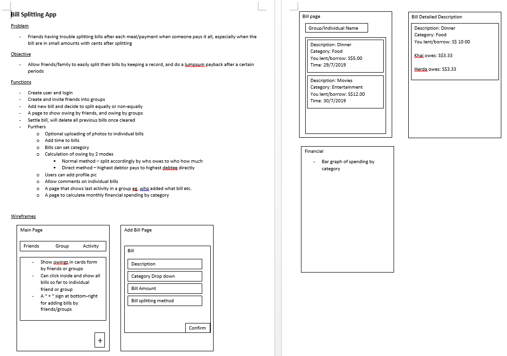

# BillSplitter

#### visit https://billsplit.bhanuprakash.tech/ to register and use the application

## TOC

- [BillSplitter](#billsplitter)
  - [TOC](#toc)
  - [Project Description](#project-description)
    - [Introduction](#introduction)
      - [Layout of the project](#layout-of-the-project)
    - [Entities in the postgresql database](#entities-in-the-postgresql-database)
    - [The Functionality of the application](#the-functionality-of-the-application)
  - [Output](#output)
    - [Personal](#personal)
    - [Group](#group)
    - [Friends](#friends)
    - [Activity](#activity)

## Project Description

### Introduction

This application makes it easy to split bills with friends and family. This package organizes all the shared expenses and IOUs in one place so that every user can see who they owe.
Postgresql database is used as the database for the project as it's cloud database, it enables to build applications faster, handle highly diverse data types, and manage applications more efficiently at scale. This project uses ReactJS as a frontend framework and NodeJs for server-side programming.

#### Layout of the project

### Entities in the postgresql database

This project would consist of the following tables in postgresql:-

(i) group: It is the organisation in which the user intends to split the bill, this contains the participants, group_name, group_id, group_description as the attributes.

(ii) users: The user is the entity who utilises the application, This contains username, phone number, email_id, upi_id(for payment), password as the attributes

(iii) bills: The bill updated by the user in a group

(iv) activity: The activities involving the user like creating a group ,updating transaction,settling it up etc.

(v) net_table: used to calculate various transaction and owing and lenting of money by the users

(vi) users_groups: The name and profilepic for each gp is stored in this

(vii) users_bills: The bill details including transactions of the bill is stored here

### The functionality of the application:-

The user is asked to register to the package with providing his contact, payment details and authentication credentials. The user can join a group or invite the registered member to a group. The expenses in the group are paid by several users for different purposes. The amount and the purpose are recorded and the amount is split among the members of the group equally or by the ratios provided for each member and each user gets a notification for the amount he owes or he ought to receive from other users in the group. Additionally features like graphical analysis, qr code for payment is added to the project.

## Output

The views of the application for personal,groups,friends and activities

## Personal

## Group

## Friends

## Activity

